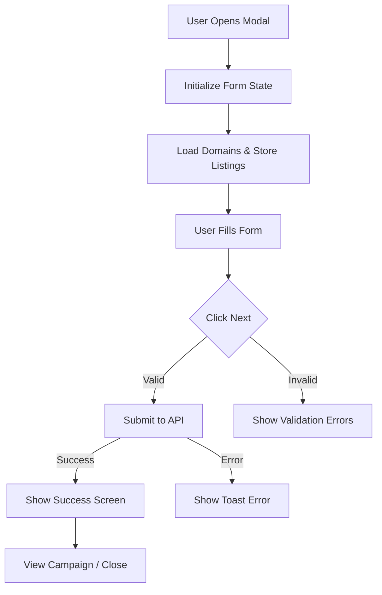

# Design Document: Create Campaign Modal Redesign

## Overview

This design document outlines the implementation of the redesigned Create Campaign modal for the Linkrunner dashboard. The redesign updates the visual appearance and interaction patterns while maintaining full compatibility with existing APIs and business logic.

The key changes include:
- Updated modal layout with new footer actions (Back, Skip, Next)
- Collapsible Advanced Options section with secondary background
- Reorganized form fields with improved visual hierarchy
- Updated styling to match the Prism design system

## Architecture

The redesigned modal follows the existing component architecture:

```
CreateCampaignModal (Container)
├── ModalRoot/ModalContent (UI Shell)
├── ModalHeader (Title + Close Button)
├── ModalBody
│   ├── BasicFields (Name, Website, Display ID)
│   ├── DeferredDeepLinkSection (Toggle + Conditional Input)
│   └── AdvancedOptionsSection (Collapsible)
│       ├── AdChannelSelector
│       ├── LinkOptionsCheckboxes (Shorten, Open in App)
│       ├── DomainSelector
│       └── StoreListingSelector
├── ModalFooter (Back, Skip, Next buttons)
└── CampaignSuccessScreen (Post-creation)
```

### State Management

The modal uses the existing state management approach:
- `useCampaignFormState` hook for UI state (collapsed sections, selections)
- `react-hook-form` with Zod validation for form state
- `useCreateCampaignMutation` for API interactions

### Data Flow



## Components and Interfaces

### CreateCampaignModal

Main container component that orchestrates the modal.

```typescript
interface CreateCampaignModalProps {
  open: boolean;
  onOpenChange: (open: boolean) => void;
}
```

### AdvancedOptionsSection

New collapsible section component for advanced settings.

```typescript
interface AdvancedOptionsSectionProps {
  isExpanded: boolean;
  onToggle: () => void;
  children: React.ReactNode;
}
```

### ModalFooterActions

Updated footer with Back, Skip, Next buttons.

```typescript
interface ModalFooterActionsProps {
  onBack: () => void;
  onSkip: () => void;
  onNext: () => void;
  isLoading: boolean;
  isDisabled: boolean;
}
```

### Form Field Components

Existing components with updated styling:
- `Input` - Text input with updated border and placeholder styles
- `Switch` - Toggle switch for deferred deep linking
- `Checkbox` - Checkbox with updated checked state styling
- `Select` - Dropdown with caret icon and helper text support

## Data Models

### FormValues (Existing - No Changes)

```typescript
interface FormValues {
  name: string;
  link: string;
  default_link: boolean;
  website: string;
  custom_display_id: string;
  open_in_app: boolean;
  is_shortlink: boolean;
  meta: boolean;
  meta_web_to_app: boolean;
  meta_campaign_id: string;
  meta_account_id?: number;
  google_ads: boolean;
  google_campaign_id: string;
  google_account_id?: number;
  jio_coupons: boolean;
  ad_network_code: string;
  domain_id?: number;
  tiktok: boolean;
  ad_channel: string;
}
```

### CampaignFormState (Extended)

```typescript
interface CampaignFormState {
  defaultLink: boolean;
  selectedStoreListingId: number | null;
  selectedDomainId: number | null;
  showMoreOptions: boolean;  // Controls Advanced Options expansion
  selectedAdChannel: string;
  campaignLink: string;
  adNetworkCode: string;
}
```

## Error Handling

### Form Validation Errors
- Display inline error messages below invalid fields
- Prevent form submission until all required fields are valid
- Use red border color for invalid inputs

### API Errors
- Display toast notifications for API errors
- Handle 400 errors (duplicate campaign) with navigation option
- Handle 402 errors (insufficient credits) with credits modal

### Network Errors
- Show generic error toast for network failures
- Maintain form state to allow retry
